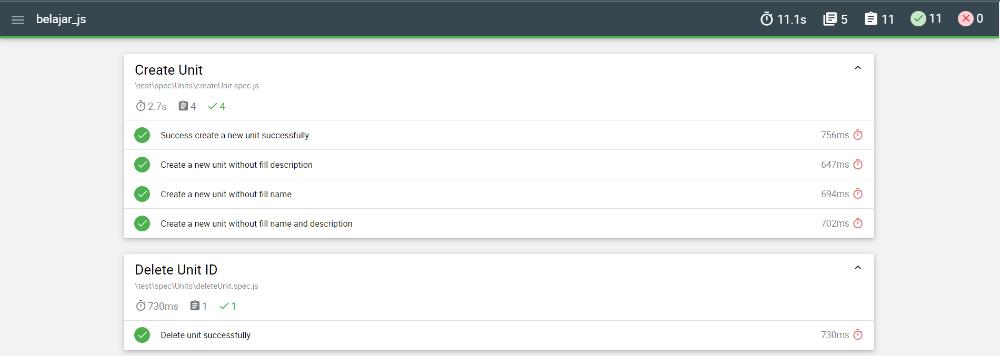

# Javascript API Automation

## Introduction
This repository was created to API test automation of 
KasirAja APIs.
<br/> Technologies used:
<br/> [Mocha](https://www.npmjs.com/package/mocha)
<br/> [Chai](https://www.npmjs.com/package/chai)
<br/> [Supertest](https://www.npmjs.com/package/supertest)
<br/> [Nodejs](https://docs.npmjs.com/downloading-and-installing-node-js-and-npm)

## Setup
### Pre-requisites
- Download and install Node.js
- Download and install any Text Editor like Visual Code
- Initilize the project with default settings npm init
- Install dependencies npm install supertest mocha chai mochawesome

### Setup Git Repository
- Clone the repository into a folder https://github.com/sofiaa53/javascript_api_automation.git
- Go to Project root directory and install Dependency: npm install
- All the dependencies from package.json would be installed in node_modules folder.

## Run Suite
- Clone the project
- Open terminal
- Traverse to the project directory
- Open suite folder ```$ cd spec/suite```
- Run suite ```$ npx mocha {filename}.suite.js```
- Execution Example [Click Here](https://drive.google.com/file/d/1NHUP5EXpGyhFOn-3mGkOYp93ndUT4YJB/view?usp=sharing)

## Run Single File
Sometimes its useful to only execute a single test file, to do so use the following command: <br/>
```$ npx mocha test/spec/{foldername}/{filename}.spec.js```

# Run via npm run
You can also run the project from npm run. Check the test definition on the 
> package.json > scripts </br>

Run the program : </br>
```$ npm run {script_name}```

# Reporter
The project uses reporter from [Mochawesome](https://www.npmjs.com/package/mochawesome)
- Install mochawesome <br>```$ npm install mochawesome```
- Tell mocha to use the Mochawesome reporter: <br>```mocha testfile.js --reporter mochawesome```
- Report Example 
## Author 
[Sofia Awiliyah](https://www.linkedin.com/in/sofia-awiliyah-365206192/) (QA Engineer, 2023)